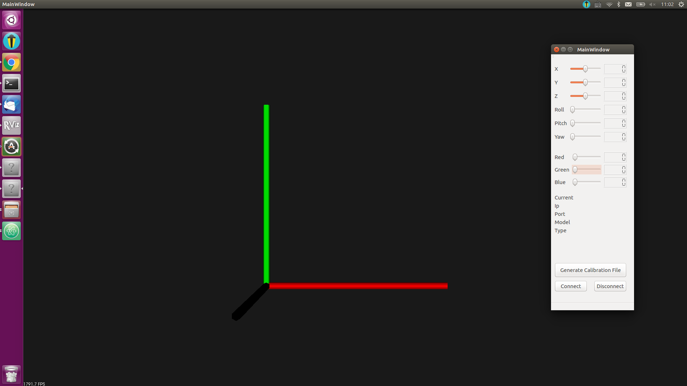
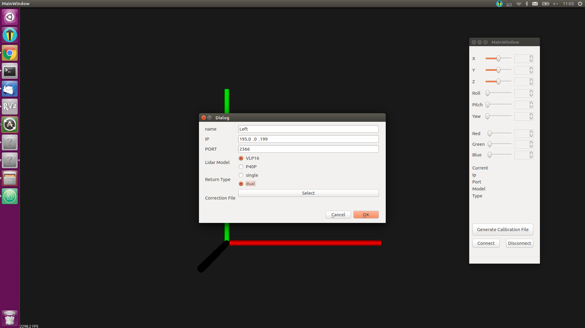
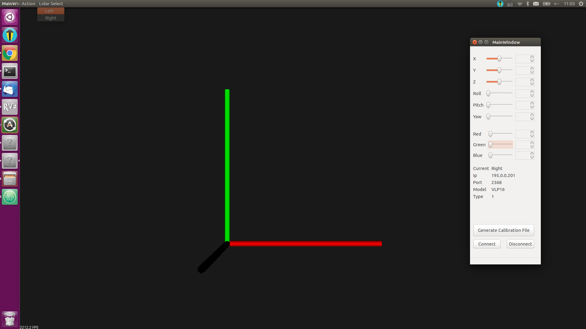
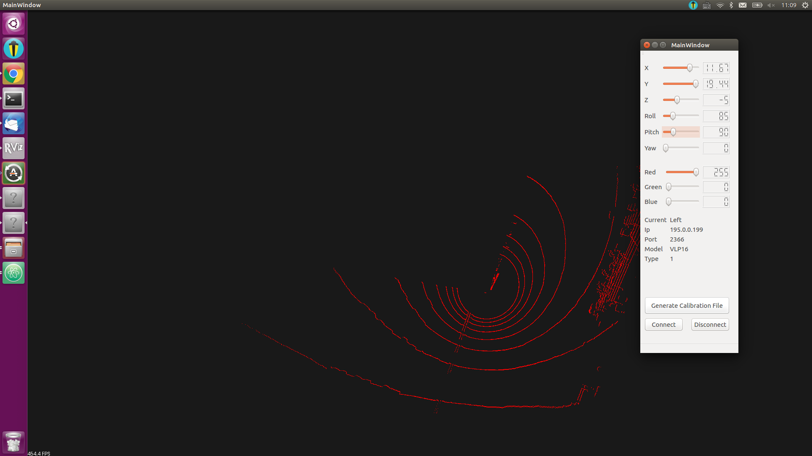

#### Multiple Lidar Point Cloud Display and Calibration Tool

## Build and Execute
```
Generate <Makefile file>. `qmake test.pro`
Build. `Make`
Execute. `./lidar_calibration`
```

## How to use
1. Initial page.

2. Click the "Add Lidar" menu bar.

3. Add Lidars. The name should be unique. Make sure that the ip and port is correct, otherwise the cloud will not be displayed. The "P40P" should select its own correction file.

4. Switch between added Lidars.

5. Connect or disconnect.

6. Modify the coordinate and generate a calibration file in the selected path.


### Version 1.0
```
 * Support the model of "VLP16" and of "P40P".
 * Display multiple lidar point clouds.
 * Change the color and the coordinate of point cloud center for each cloud.
 * Generate the calibration file in a selected path.

 BUG:
 * If one of the lidars is connected. A new "Add Lidar" action will cause the crush of the application. So do the connection after all the lidars have been added.

 * Straight and quick action will also crush the application.
```

### Version 1.1 (On going)
```
 * Support the loading of the calibration file.
 * Support the automatic calibration of the ground plan.
 * Bug fixing.
```
